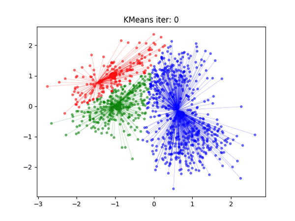
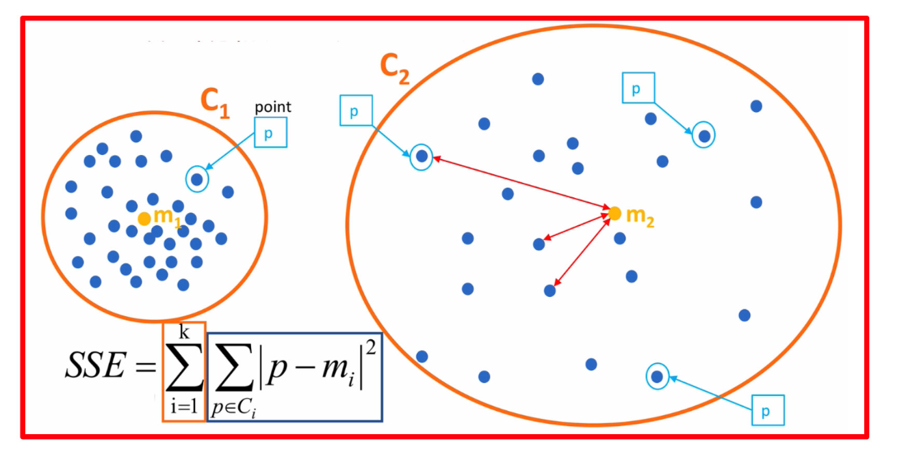
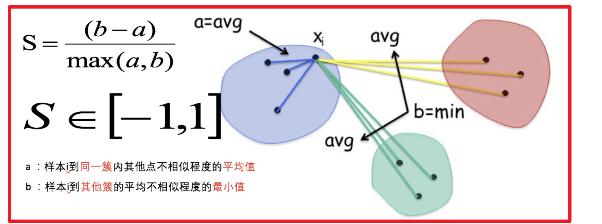

## K-Means 

K-Means 聚类算法是一种广泛应用于数据分析和模式识别的无监督学习方法，它的核心思想是将数据点划分为不同的簇，使得同一簇内的数据点彼此相似，而不同簇之间的数据点差异较大。

K-Means 算法的工作原理相对直观：首先，它随机选择一些数据点作为初始的簇中心，然后通过迭代的方式将每个数据点分配到离它最近的簇中心，接着重新计算每个簇的中心点，不断重复这个过程，直到簇中心不再发生显著变化或达到预定的迭代次数。最终，K-Means 算法将数据点划分为 K 个簇，每个簇由一个中心点和与之相关的数据点组成。

K-Means 算法的应用非常广泛，比如分类问题、图像分割、推荐系统、异常检测等不同的领域。

### K-Means 算法的原理

K-Means 算法的基本原理是将数据集中的数据点划分为 K 个簇，每个簇包含数据点，使得同一簇内的数据点彼此相似度较高，不同簇之间的数据点相似度较低。

算法步骤如下：

- Step 1：初始化。随机选择 K 个数据点作为初始聚类中心。

- Step 2：分配数据点。将每个数据样本点分配到与其最近的聚类中心所属的簇。

- Step 3：更新聚类中心。重新计算每个簇的聚类中心（计算每个簇中所有数据点的平均值）。

- Step 4：迭代。重复步骤 2 和 3，直到聚类中心不再发生明显变化或达到预定的迭代次数。

- Step 5：输出结果。算法结束后，每个数据点都被分配到一个簇中。

K聚类动态效果图

### K 值如何确定？  

k-means的误差平方和

#### 肘部法则

肘部法则是一种用于确定 K-Means 聚类中最佳簇数 K 的启发式方法。它基于聚类簇数量 K 与聚类误差（或簇内误差平方和）之间的关系来进行评估。

肘部法则的基本思想是，随着簇数 K 的增加，簇内平方和会逐渐减小，因为更多的簇意味着每个簇内的数据点更接近其簇中心。但当 K 增加到某个临界点时，簇内平方和的下降速度会减缓，因为进一步增加簇数只会引入较少的额外信息，而不会显著降低误差。

肘部法则之所以称为肘部，是因为图像通常在 K 达到最佳值后会呈现出一个弯曲的肘部形状。需要注意的是，肘部法则是一种启发式方法，不一定总是能够准确找到最佳的 K 值，特别是在数据分布复杂或不均匀的情况下。因此，通常需要结合领域知识和其他聚类评估方法来确定最佳的 K 值。

#### 轮廓系数法（Silhouette Coefficient）

结合了聚类的凝聚度（Cohesion）和分离度（Separation），用于评估聚类的效果：

**目的**：

 内部距离最小化，外部距离最大化

计算样本i到同簇其他样本的平均距离ai，ai 越小样本i的簇内不相似度越小，说明样本i越应该被聚类到该簇。

计算样本i到最近簇Cj 的所有样本的平均距离bij，称样本i与最近簇Cj 的不相似度，定义为样本i的簇间不相似度：bi =min{bi1, bi2, ..., bik}，bi越大，说明样本i越不属于其他簇。

求出所有样本的轮廓系数后再求平均值就得到了 平均轮廓系数 。

平均轮廓系数的取值范围为[-1,1]，系数越大，聚类效果越好。

簇内样本的距离越近，簇间样本距离越远

#### Gap 统计量 

todo 

### 注意点

1）数据的异常值。数据中的异常值能明显改变不同点之间的距离相似度，并且这种影响是非常显著的。因此基于距离相似度的判别模式下，异常值的处理必不可少。

2）数据的异常量纲。不同的维度和变量之间，如果存在数值规模或量纲的差异，那么在做距离之前需要先将变量归一化或标准化。例如，跳出率的数值分布区间是[0，1]，订单金额可能是[0，10000000]，而订单数量则是[0，1000]。如果没有归一化或标准化操作，那么相似度将主要受到订单金额的影响。