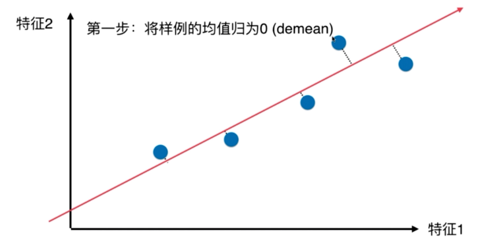
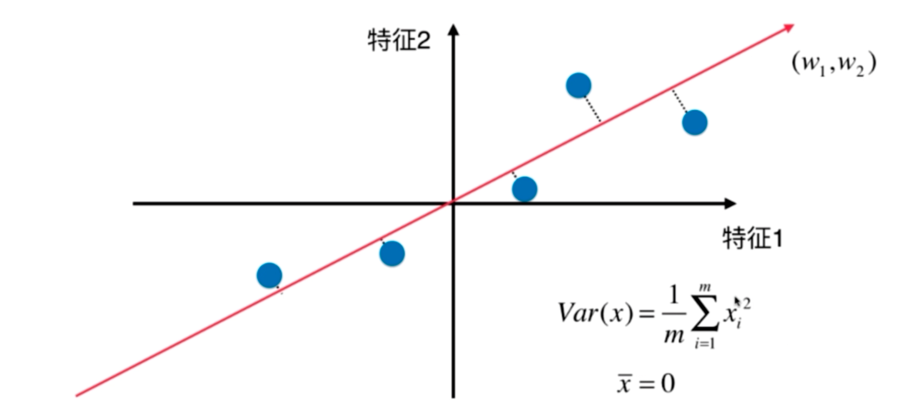
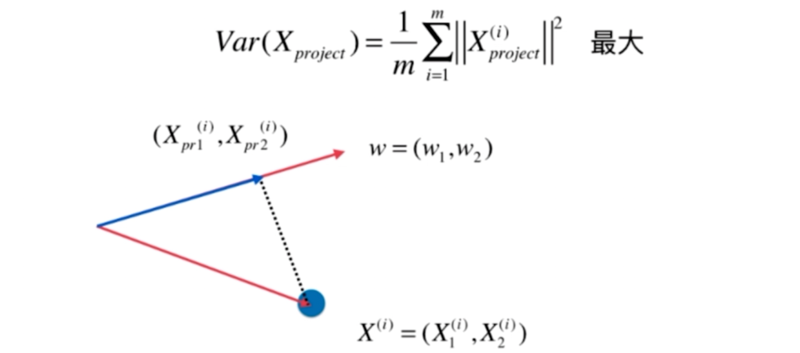
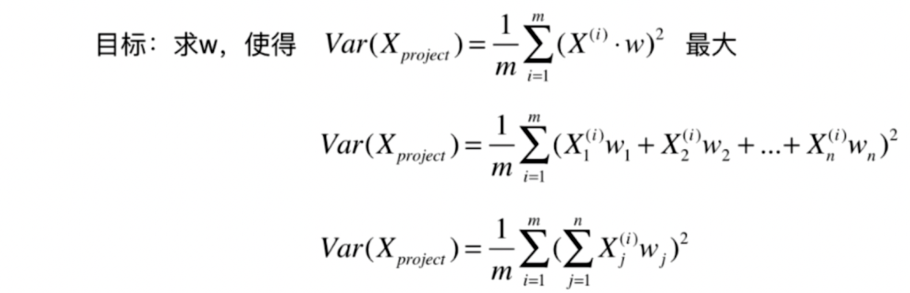
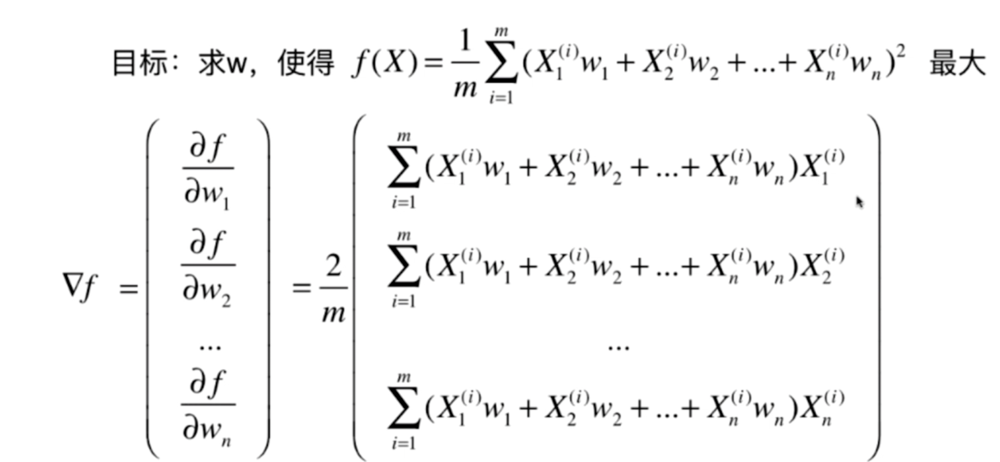
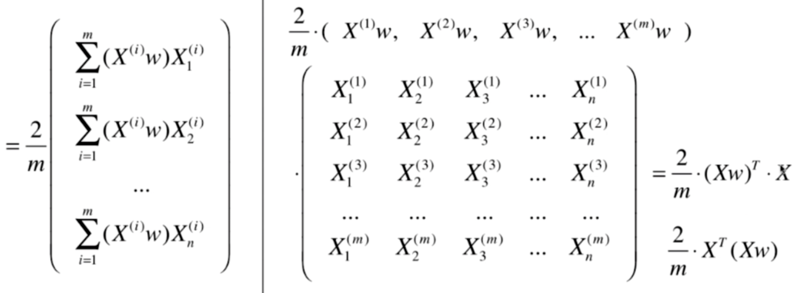

## PCA 

pca： 主要成分分析
- 一个非监督的机器学习算法
- 主要用于数据的降维
- 通过降维，可以发现更便于人类理解的特征
- 其他应用：可视化；去噪


- 如何找到样本间间距最大的轴
- 如何定义样本间间距
  - 使用方差，方差大区分度大 （降维后区分度要大才好)


二维示例： 




1. 对所有的样本进行demean处理 （减去平均值)
2. 我们想要求一个轴的方向 w=(w1,w2)
3. 使得我们所有的样本映射到w以后，有



解释： 去掉上面均值为0， 把向量平移到w向量上， 蓝色的线就是我们要求的距离，尽量让这个更大。

```text
向量的点乘=向量的模 * 向量的模 * cosΘ
X(i).w = ||X(i)|| . ||w|| .cosΘ

w为方向向量 ？ ，它的模=1

X(i).w = ||X(i)||  .cosΘ

X(i).w  = ||X_project(i)||
```




**一个目标函数的最优化问题，使用梯度上升法解决**




结果是 多行1列的 矩阵。所以有了最后一步： 1行多列的矩阵还要进行一次转置。


 