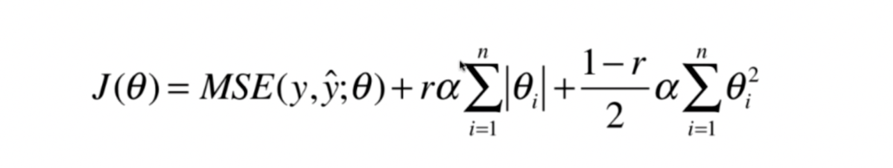

## 多项式回归与模型泛化


### 什么是多项式回归

线性回归模型不能很好的拟合预测数据， 通过增进特征项来达到拟合。


### scikit-learn中的多项式回归

poly = PolynomialFeatures(degree=2)  

就是最高增加2次幂的特征

如有2个特征x1,x2 ,那么会增加4列:
- 全是1的（0次幂）
- x1^2
- x2^2 
- x1*x2 

poly = PolynomialFeatures(degree=3), 就是最高增加3次幂的特征
x1,x2 -> 1,x1,x2,x1^2,x2^2,x1*x2,x1^3,x2^3,x1^2*x2,x2^2*x1


### 欠拟合与过拟合

过拟合：一个假设 **在训练数据上能够获得比其他假设更好的拟合， 但是在测试数据集上却不能很好地拟合数据** (体现在准确率下降)，此时认为这个假设出现了过拟合的现象。(模型过于复杂)

欠拟合：一个假设 **在训练数据上不能获得更好的拟合，并且在测试数据集上也不能很好地拟合数据** ，此时认为这个假设出现了欠拟合的现象。(模型过于简单)

解决方案：L1正则化、L2正则化

#### 欠拟合
**欠拟合产生原因：** 学习到数据的特征过少

解决办法：

- 添加其他特征项，有时出现欠拟合是因为特征项不够导致的，可以添加其他特征项来解决

- 添加多项式特征，模型过于简单时的常用套路，例如将线性模型通过添加二次项或三次项使模型泛化能力更强

#### 过拟合

**过拟合产生原因：** 原始特征过多，存在一些嘈杂特征， 模型过于复杂是因为模型尝试去兼顾所有测试样本

解决办法：

- 重新清洗数据，导致过拟合的一个原因有可能是数据不纯，如果出现了过拟合就需要重新清洗数据。
- 增大数据的训练量，还有一个原因就是我们用于训练的数据量太小导致的，训练数据占总数据的比例过小。
- 模型正则化
- 减少特征维度；降噪
- 降低模型复杂度
- 使用验证集


### 学习曲线

随着训练样本的逐渐增多，算法训练出的模型的表现能力。

根据样本数的增进，看分数值（误差值) 的图 观察，欠拟合、欠拟合，正好拟合的情况。 

### 验证数据集与交叉验证

- 训练数据集  (产模型)
- 验证数据集  (产模型)
  - 调整超参数使用的数据集
- 测试数据集
  - 作为衡量最终模型性能的数据集。

#### K交叉验证

推荐用这个。 这个得到的结果才是最好拟合的。 

原理就是将数据集合分成k份 ，将k-1份数据进行训练，重复k次，每个子级都会被当成测试集 。通常我们会取k次验证的平均值作为最终性能指标。

缺点就是： 相对慢了k倍.

### 偏差方差平衡

- 偏差： 里正确目标的差
- 方差： 结果之间的差距

模型误差 = 偏差 + 方差 + 不可避免的误差


导致偏差的主要原因：
- 对问题本身的假设不正确
  - 如：非线性数据使用线性回归
  - 如 欠拟合underfitting


- 有一些算法天生是高方差的算法。如knn。
- 非参数学习通常是高方差算法。因为不对数据进行任何假设
- 有一些算法天生是高偏差算法。如线性回归。
- 参数学习通常都是高偏差算法。因为堆数据具有极强的假设。

偏差和方差通常是矛盾的，降低偏差会提高方差，降低方差，会提高偏差。

机器学习的主要挑战，来自于方差!。

过拟合 = 高方差。 


### 正则化

在解决回归过拟合中，我们选择正则化。但是对于其他机器学习算法如分类算法来说也会出现这样的问题，除了一些算法本身作用之外（决策树、神经网络），我们更多的也是去自己做特征选择，包括之前说的删除、合并一些特征


**在学习的时候，数据提供的特征有些影响模型复杂度或者这个特征的数据点异常较多，所以算法在学习的时候尽量减少这个特征的影响（甚至删除某个特征的影响），这就是正则化**

注：调整时候，算法并不知道某个特征影响，而是去调整参数得出优化的结


**L2正则化**


控制特征的Θ的值，让损失尽可能小。 原来的损失函数融合进 Θ的L2范数的平方。

使用L2正则化线性回归模型 就是 Ridge回归

```python
from sklearn.linear_model import Ridge
```

**L1正则化**


在损失函数中添加L1正则化项

alpha：  代表惩罚系数（正则化系数) ， 后面是 n个参数ｗ的  L1范数。也是个超参数。 越大惩罚越大。


使用L1正则化线性回归模型 就是 LASSO回归

```python
from sklearn.linear_model import Lasso
```

LASSO趋向于使得一部分theta值变为0 。所以可以作为特征选择用。 


### L0正则化


就是 让Θ个数 尽可能的少， 但是这种一般不用，是np难度 ，用L1代替正则化。


### 弹性网Elastic Net



是岭回归和LASSO回归 结合。

L2正则化需要的计算能力更高点，退而求其次可以用这个 弹性网。