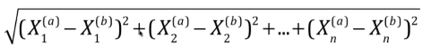

# 推荐系统快速入门 

通过一个商城系统的用户数据，简易入门下推荐系统

## 用户相似性计算

用户给商品评价分数，看评价分数是否相似（两个向量的夹角，可以是高维度的） ，那么代表口味相似。

假设用户１给 3个商品评价是 (2,2,2),用户２给这３个商品评价是(5,5,5) .通过余弦定理相似性相等，那么可以代表用户１和用户２ 口味相似 （这里其实有点问题，看下面)


### 余弦定理向量式

#### 余弦定理

非直角三角形

A角对ａ边，B角对ｂ边，C角对ｃ边

cosC = (a^2+b^2-c^2 ) / 2ab

cosB = (a^2+c^2 - b^2)/2ac

cosA = (c^2+b^2 - a^2)/2bc


#### 余弦定理向量式公式

余弦相似性

cos(theta) ＝ (a.b)/(||a||2.||b||2)

cos(theta) = (a向量 . b向量) / ((ａ向量l2范数).(b向量l2范数))

如：(3,2,3) 和 (4,2,3)

cos(theta) = (12+4+9) / (sqrt(9+4+9) .(sqrt(16+4+9))) = 25/(sqrt(22).sqrt(29)) = 0.9897


注意： 余弦值越小，代表夹角越大，两者越不相干，反过来：值越大则越相关（越接近)


#### 修正余弦相似性


这样的２个用户给３个商品打分，如果用余弦相似性，他们算出来还是特别的相似，但是一眼我们就能看出问题来。 

```python
user1=np.array([2,1,2])
user2=np.array([5,4,4])
print(cosine_similarity(user1.reshape(1,3),user2.reshape(1,3))) # 0.97
```

都减去平均值，再走原来的公式
```python
user1=np.array([2,1,2])
user1=user1-user1.mean()
user2=np.array([5,4,4])
user2=user2-user2.mean()
print(cosine_similarity(user1.reshape(1,3),user2.reshape(1,3))) # 0.5
```


## 用户消费能力

假设有一组数据，每月的用户消费金额
```text
      1 ２ ３ ４ ５  （month)
用户1 500 14 5 10 15
用户2 5 100 200 150 100
...
```

同一类商品比较消费能力使用:   欧拉距离 



假设有不同种类的商品
- 电子产品 （利润低，单价高)
  - 用户ａ  １月到５月的  消费是  500,2000,10000,300,5000
- 零食 (利润高，单价低)
  - 用户b  1到５月消费是   200,300,500,1000,100

如果这种情况也用欧拉距离进行计算，那么差距还是很大的。 但是 零食的利润确比 电子产品高。 


### 数据标准化


#### 归一化

把数据都映射到 0-1中。
```text
x_scale = (x - min(x)) / (max(x) - min(x))
```

如果数据很不规整，有很大的极大值，和极小值， 那么这种数据采用这种方式，会使数据不准确。

#### 标准化

```text
# 标准差
s = np.std(x)
x_scale= (x - x_mean) / s
```

### 欧式距离标准化

```python
from scipy.spatial.distance import cdist 
user1=np.array([[500,2000,1020,10000,880,500]])
user2=np.array([[300,1000,600,3000,600,300]])
print(cdist(user1,user2))
print(cdist(user1,user2,"seuclidean")) #标准化后的欧式距离
```

## User-Based、item-Based

计算用户的相似性，叫做User-Based。 根据用户相似性譬如把用户ａ（或者一批和用户ａ口味最邻近的用户）的商品推荐给用户ｂ。 


计算商品的相似性，叫做item-Based。 

电商网站：  item-Based 更合适，用户数> 商品数，前者变动大。

新闻网站的内容推荐: userBased更合,   用户数<新闻数，后者变动更大。 


## NearestNeighbors算法＋余弦相似性

通过NearestNeighbors找出最相似的用户，然后拿这个用户的习惯商品，推荐给另外的用户。 


## links

- [推荐系统一个比较好的包](https://github.com/NicolasHug/Surprise)