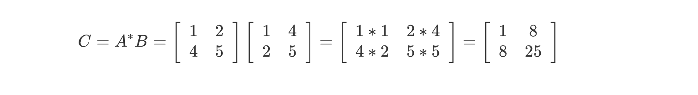
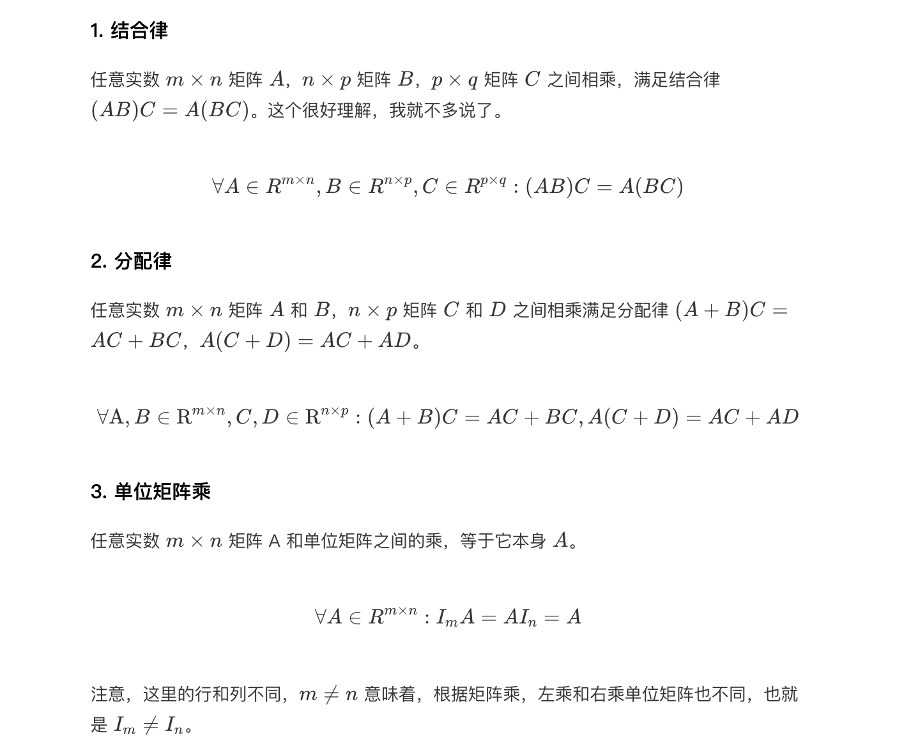

# 线性代数

很多个数，我们可以用括号括起来，形成一个数组。在几何学上，数组被称作向量，向量就是一个有大小有方向的直线段。

所以，线性代数就是：输入一段直线，经过加工之后，产出一段直线

向量[1,2]的全称其实是1i+2j，i和j叫做基向量

矩阵对向量的加工过程: 左行乘右列


## 向量

向量是有序的数字列表


单位向量：数轴上的一单位长度，长度都唯一，x轴，y轴各一个 如


零向量：原点，即向量的所有元素都为零。


在线性空间中，所有其他向量都是以上两种向量的线性组合。 或者说，用单位向量和零向量，可以通过加法和数乘组合出任意一个其他向量。 N个向量的标量乘法之和被称为这几个向量的线性组合


张量空间： 向量 v, w 的 **全部线性组合**所构成的向量集合称为向量 v, w 所 **张成的空间**

### 向量的运算

向量有大小和方向

向量的加法：2维空间内，就是求给定2个向量所围成的平行四边形的对角线。


向量基运算， 同位置+,-，乘

```text
(1,2,3)  + (4,5,6) = (5,7,9)
(1,2,3)  - (4,5,6) = (-3,-3,-3)
(1,2,3) * 3 = (3,6,9)
```

向量矩阵转置，行变列
```text
(1,
 2,     =>  (1,2,3)
 3)
 
[
[1,2],            => [[1,3],
[3,4]                 [2,4]]
] 

 
```
```python
import numpy as np 
d1 = np.array([[1,2],[3,4]])
print(d1)
print(d1.T)
```


### 基向量

向量 i, j 称为基向量，其他向量都可以通过对基向量缩放再相加的方法构造出来。基向量缩放的倍数对应向量的各个分量，即向量对应的坐标。


以二维平面直角坐标系为例，i, j 分别是沿 2 个坐标轴方向的单位向量。那么
坐标平面上的其他向量，例如 [3−2] 与 i, j 是什么关系呢

一组基向量就对应一个坐标系，选择不同的基向量就构造出了不同的坐标系。同一个向量，在不同的坐标系下（即采用不同的基向量），其坐标值也要相应地发生变化。


 
### 范数

范数（norm) 是数学中的一种基本概念
- L1范数 - 向量中各个元素绝对值之和
- L2范数 - 向量的模长，每个元素平方求和，再开平方根
  - **X的转置.X = L2范数的平方**  
- p范数， 向量中每个元素p幂次求和，再开p次根

```text
L1范数
xT = (1,2,-3)  ; ||x||1 = |1| +|2|+|3|=6

L2范数
xT = (1,2,-3)  ;  ||x||2 = sqrt(1+4+9) = sqrt(12)


Lp范数 ||x||p = (|x1|^p + ... |xn|^p) ^ (1/p)
```


## 矩阵

由 m × n 个数aij排成的m行n列的数表称为m行n列的矩阵，简称m × n矩阵


当m=n时，我们称之为n阶矩阵或n阶**方阵**

特殊情况：

（1）行矩阵：当m=1时，即只有一行的矩阵A = [a1,a2,.....an]称为行矩阵或行向量。

（2）列矩阵：当n=1时，即只有一列的矩阵! 称之为列矩阵或列向量


**单位阵** 特殊的方阵，斜对角线都是1 


### 矩阵的加减法 

**两个矩阵相加，矩阵的形状必须相同**

**两个矩阵相减，矩阵的形状必须相同**

矩阵加减 满足 交换律、结合律
- a+b = b+a
- a+b+c = a+(b+c)

### **矩阵数乘运算** 

矩阵的数乘运算规则同加法、减法运算相同，都是对应位置元素进行运算，要求两个矩阵的形状相同，若形状不同则需满足广播机制。

```python
import numpy as np 
fruit_price=np.array([[5,4,3]])  
fudu=np.array([1.5,0.75,3])  
print('水果价格浮动后价格为:\n',fruit_price*fudu)
#价格降低1元为:
#[[7.5 3.  9. ]]
```


### **矩阵与矩阵运算**

#### 普通矩阵相乘
矩阵乘法公式：

设矩阵 A 是一个 m×n 的矩阵，矩阵 B 是一个 n×p 的矩阵，那么它们的乘积 C 是一个 m×p 的矩阵，其中 C 的第 i 行第 j 列元素为：


普通矩阵相乘: **前一个矩阵的列一定要和后一个矩阵的行大小相同**。

运算规则：需要注意进行矩阵乘法的两个矩阵要求前一个矩阵的列要和后一个矩阵的行的轴长相同，只有保证这个条件才能够进行矩阵乘法。也就是说前面的矩阵的列数和后面矩阵的行数一致两个矩阵才能点乘。 同时矩阵乘法是满足结合律并不满足交换律的，即 ABC 等于 A(BC)，不等于 ACB。

我们的数据的维度往往是不符合要求的，这是就需要进行升维。

#### 哈达玛积

矩阵大小一样， 同位置相乘


#### 克罗内克积

### 矩阵的性质


**A矩阵*I单位矩阵=A矩阵**

**矩阵的逆A-¹ * 矩阵A = 单位矩阵I**


### 行列式

（1）行列式的本质是一个值

（2）二阶行列式的计算有一个“对角线法则”。

注意：det(MN)=det(M)det(N)两个矩阵 M, N，积的行列式=行列式的积 

行列式行数必须等于列数。也就是说必须是方阵才有行列式。


### 矩阵转置

行 变成列 

A矩阵的行变成 同序号的列 得到的新矩阵称为  A矩阵的转置 记作A' 或 A T

下面是公式： 


### 矩阵的初等行变换

１. 换法变换：对换矩阵的两行。对换i，j两行，记作ri <->rj。
  
    逆变换: ri <->rj。 再反一次

2. 倍法变换：用非零数乘以矩阵某一行的每个元素。第i行乘以K，记作ri*k.
    
   逆变换:  ri/k

3. 消法变换：用数乘矩阵某一行的每个元素后加到另一行的对应元素上，第j行的k倍加到第i行上，记作ri + krj。

  逆变换:  ri-krj ,再减回去

### 高斯消元

概念：高斯消元法是求解线性方阵组的一种算法

前提：
（1） 任意交换矩阵的两行或两列，矩阵不变；

（2）矩阵任意行或列加上或减去任意k倍的任意行或列（行也可以加减k倍的行），矩阵不变；


### 逆矩阵

𝐴−1𝐴 必须等于什么都没做。那么，在所有矩阵中主对角线元素为1，其他元素都为0的矩阵，就代表
什么都不做的变换。这种矩阵称为单位矩阵，记作I或者E.
所以 𝐴−1𝐴 = I （单位矩阵) 

A 矩阵 乘 A的逆矩阵 等与单位矩阵。 

假设 X . A = B , 矩阵X乘A ＝B,

X = B . A的逆矩阵  （上面两边都乘A的逆矩阵)


行列式等与０ ，逆不存在。 


###  矩阵的秩

矩阵的秩 ：线性变换后空间的维数

子式：假设A为m*n矩阵，任取A中的K行K列所得到的K阶行列式称之为A的一个K阶子式。


二阶子式：

矩阵的秩：矩阵A中非零子式的最高阶数为矩阵A的秩，记作r(A).r(A)=2.

总结：这个数学家在处理某个矩阵的时候，发现需要知道怎么如何用最少的几个向量去表达这个矩阵向量组，他为此引入了秩的概念。我们知道了秩，就知道了这个矩阵向量组的最关键的几个向量组，我们用这两个向量组通过数乘运算就可以表达其他向量组