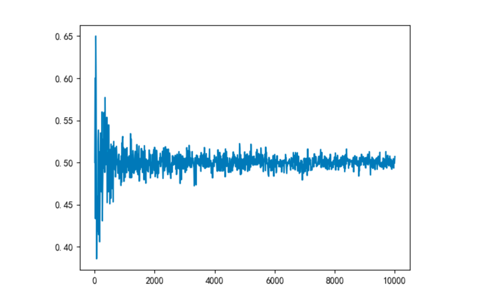

# 统计学


统计学
- 描述统计
- 统计推断
  - 参数估计
  - 假设检验
  - 贝叶斯统计

 


## 描述统计

描述统计是研究
- 数据的收集
  - 数据的可靠性、有效性
- 通过图、表形式对数据进行加工处理和可视化
- 通过概括与分析得出反应客观现象的规律性数量特征


### 分类变量
无序分类变量: 如 男、女

有序分类变量： 如 小学（1)、初中(2)、高中(3)、本科(4)、研究生(5)

| -        | 无序分类变量 | 有序分类变量 |
| -------- | ------------ | ------------ |
| 表       | 频率表       | 频率表       |
| 图       | 条形图       | 条形图       |
| 集中趋势 | 众数         | 众数、中位数 |
|          |              |              |


众数： 出现最多的数（可以有多个)

中位数： 位于中间的那个数。 偶数是中间2个除以/2 ,奇数个就是中间那个数。

四分位数： %25分位点(Q1)，%50(Q2)，%75分位点(Q3) 
- 14个元素的 ，Q1=  第4个元素，  14/2,7的中间是4.
- 16个元素， Q1 = (第4+第5个元素）/2, 8个元素中间是4，5.
- IQR(四分位距) = Q3-Q1 


### 数值变量


 (等距)数值变量: 如温度 、 时间

| -        | (等距)数值变量         |
| -------- | ---------------------- |
| 表       | 频率表                 |
| 图       | 频率直方图、箱图       |
| 集中趋势 | 众数、中位数、均值     |
| 离散趋势 | 极差、分位数、四分位数 |


箱线图： 最小值、Q1, 中位数、Q3 、最大值

极差（全距)=最大值-最小值


(等比)数值变量: 身高、体重， 可以加、减、乘除

| -        | (等比)数值变量    |
| -------- |-------------|
| 表       | 频率表         |
| 图       | 频率直方图、箱图    |
| 集中趋势 | 众数、中位数、均值   |
| 离散趋势 | 极差、分位数、方差、标准差     |

### python实现各种值

```python
from collections import Counter
from math import sqrt

def frequency(data):
    """频率"""
    counter = Counter(data)
    ret = []
    for point in counter.most_common():
        ret.append((point[0], point[1] / len(data)))
    return ret


def mode(data):
    """众数"""
    counter = Counter(data)
    if counter.most_common()[0][1] == 1:
        return None, None

    count = counter.most_common()[0][1]
    ret = []
    for point in counter.most_common():
        if point[1] == count:
            ret.append(point[0])
        else:
            break
    return ret, count


def median(data):
    """中位数"""
    sorted_data = sorted(data)
    n = len(sorted_data)

    if n % 2 == 1:
        return sorted_data[n // 2]

    return (sorted_data[n // 2 -1] + sorted_data[n // 2]) / 2


def mean(data):
    """均值"""
    return sum(data) / len(data)


def rng(data):
    """极差"""
    return max(data) - min(data)


def quartile(data):
    """四分位数"""
    n = len(data)
    q1, q2, q3 = None, None, None
    if n >= 4:
        sorted_data = sorted(data)
        q2 = median(sorted_data)
        if n % 2 == 1:
            q1 = median(sorted_data[:n // 2])
            q3 = median(sorted_data[n // 2 + 1:])
        else:
            q1 = median(sorted_data[:n // 2])
            q3 = median(sorted_data[n // 2:])

    return q1, q2, q3


def variance(data):
    """方差"""
    n = len(data)
    if n <= 1:
        return None

    mean_value = mean(data)
    return sum((e - mean_value) ** 2 for e in data) / (n - 1)


def std(data):
    """标准差"""
    return sqrt(variance(data))
```

### 分布的形态

#### 偏度
左偏：均值 < 中位数

对称: 均值 = 中位数

右偏: 均值 > 中位数

#### 形态
单峰、多峰、双峰

#### 峰度

峰尖、尾平 表示数据向中心靠拢程度高

扁平表示数据向中心靠拢程度低


### 变量间的关系


- 两个分类变量的关系
  - 分段条形图
  - 相对频率分段条形图
- 两个数值变量的关系
  - 散点图
- 一个数值变量和一个分类变量的关系
  - 并排箱图


### 极端值

在一组数据，小于Q1-1.5IQR 或者大于Q3+1.5IQR  的数据是疑是极端值。


在一组数据中，小于Q1-3IQR，或者大于Q3+3IQR 的数据是极端值。


如何处理极端值：
- 如果是记录错误，或者其他明显的原因造成的，丢弃数据
- 原因无法解释的，保留或者丢弃
- 可以通过对比保留和丢弃极端值对结果的影响，来判断结果会否收到极端值的影响


### 缺失值

- 丢弃缺失值记录
- 缺失值的记录较多，分析原因补全缺失值
- 缺失记录较少，通过中位数、均值、众数等进行补全。


## 概率论

样本空间（Space)： 所有可能结果的集合


随机事件： 样本空间的子集 

频率: 在相同条件下，进行了n次试验；在这n次试验中，事件A发生的次数nA称为事件A发生的频数。 比值nA/n 称为事件A发生的频率。

概率：对于随机试验E的每一个事件A赋予一个实数，记为P(A),称为事件A的概率

频率近似概率

  

联合概率： 指两个或多个随机变量同时发生的概率

条件概率：表示事件A在另外一个事件B已经发生条件下的发生概率 P(a|b)


### 小数和大数定律

当次数越大的时候， 概率是趋于稳定的


```python
import random
import matplotlib.pyplot as plt


def toss():
    # 返回0 或者 1
    return random.randint(0, 1)


if __name__ == "__main__":

    indices = []
    freq = []
    for toss_num in range(10, 10001, 10):

        heads = 0
        for _ in range(toss_num):
            if toss() == 0:
                heads += 1
        freq.append(heads / toss_num)
        indices.append(toss_num)

    plt.plot(indices, freq)
    plt.show()
```