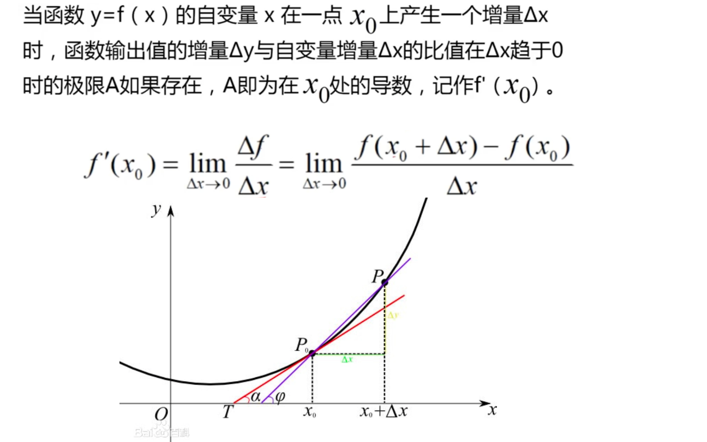
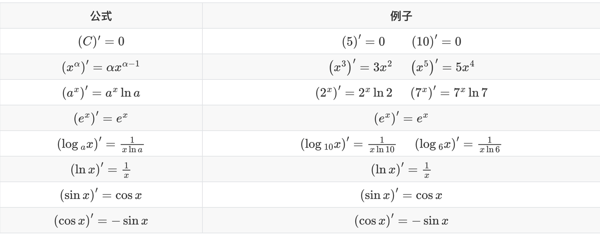
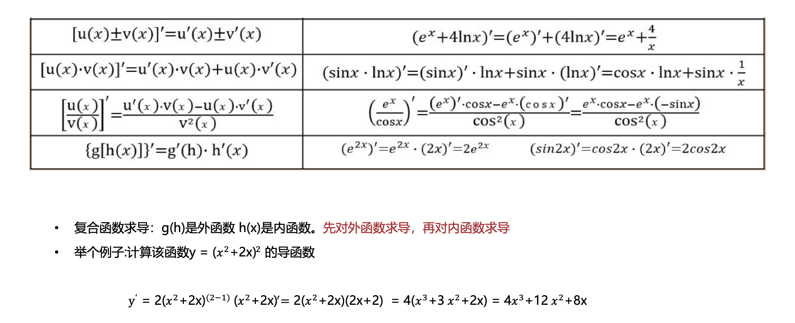
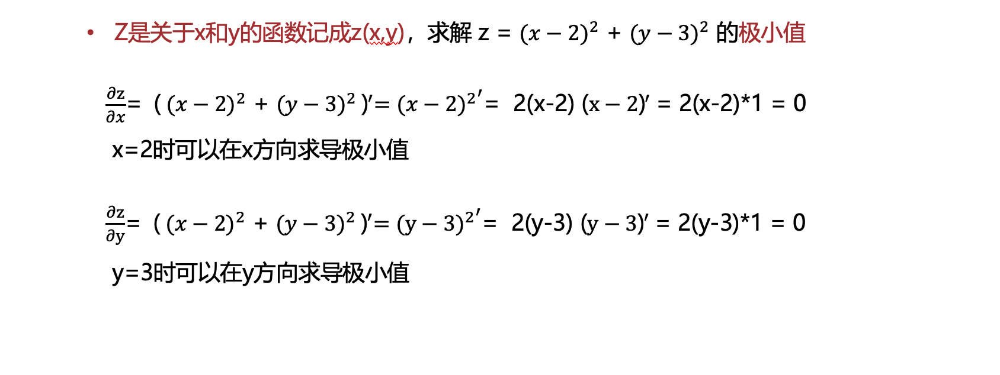
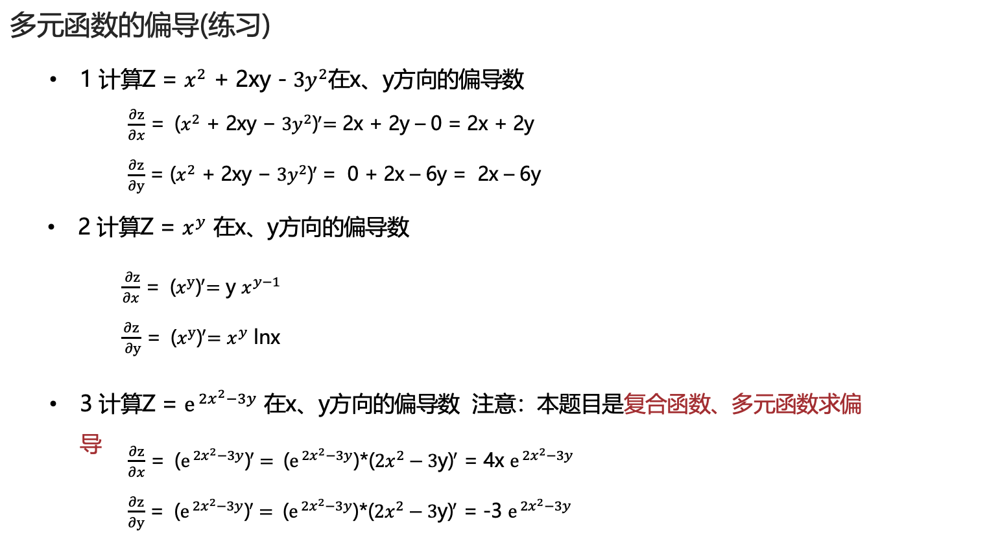

# 高等数学


## 集合、映射和函数

### 集合

集合列子：

- 某特定时间上，某城市的树的种类

非集合例子

- 100个同批次同型号的乒乓球。 无法区别（元素互异性）
- 一个城市的好人（不确定性）

集合中的元素是坐标系中的点

- {(x,y)|x+y<3}

集合有包含关系。 子集： 所有元素都是 某集合。

真子集（ 集合不相等)

### 映射

设A、B是两个非空集合，如果存在一个法则f:A->B，使得对于任意a∈A，都有f(a)∈B，则称f为A到B的映射。记作f:A→B。

b 称为元素 a 在映射 f 下的像记为 b = f(a)。

a 称为元素 b 在映射 f 上的原像

A 称为映射 f 的定义域，记作 D(f)

A 中所有元素的像所组成的集合称为映射f 的值域，记作 R(f)

- 映射三要素： 定义域，值域，对应法则
- 定义域 D(f) = A
- 值域 R(f) ∈ B
- 对于每个 a ∈ A ,元素 a 的像 b 唯一
- 对应每个b ∈ R(f) ,元素 b 的原像不一定唯一。

满射 、单射 、一一映射

逆映射

- 设f 是 A到B 的双射，那么存在一个映射 g:B→A，使得g(f(a))=a,g(b)=f(g(b))

对每个 b ∈ B ,规定g(b) = a, 这 a 满足f(a)=b

g 称为 f 的逆映射。记为 g=f^(-1)，定义域 D(g) = B, 值域 R(g) = A

### 函数

设数集D ∈ R ,则称映射f : D → R 为定义在 D上的函数。记为 y=f(x),x ∈ D，x 称为自变量，y 称为因变量， D称为定义域

反函数

设映射 f： D->E为双射(D∈R,E∈R)

则它的逆映射 f-1 : E->D称为 f 的反函数。

f(x)=x²

f-1(x)=sqrt(x)

函数单调性

函数奇偶性

奇函数： f(x)=-f(-x) ，图像关于原点对称

偶函数: f(x)=f(-x) ,图像关于 y 轴对称。

函数的周期性

#### 基本初等函数

- 幂函数 y=x^n (n∈R ，常数)
- 指数函数 y=a^x (a>0，且 a!=1)
- 对数函数 y=log_a(x) (a>0，且 a!=1)
- 三角函数 y=sin(x) ,y=cos(x) ,y=tan(x)等
  - tan(x) =sin(x) / cos(x)
- 反三角函数 y=arcsin(x)、y=arccos(x)、y=arctan(x)等

一次函数

#### 二次函数

- y=ax²+bx+c
    - 对称轴: -b/2a
    - a > 0 开口向上 ,(-♾️,-b/2a) 单调递减. （-b/2a,+♾️) 单调递增 ,最小值 (4ac-b²)/4a
    - a < 0 开口向下 ,(-♾️,-b/2a) 单调递增. （-b/2a,+♾️) 单调递减 ,最大值 (4ac-b²)/4a

#### 二次函数简单应用实例

- 桥梁建筑设计
- 篮球、排球落点
- 经济学的投资分析，售价定价


- 某商品进价 80元，按 100元出售，一天可卖 60件，经时长调查，该商品每降价 1 元，销量增加 5 件，求该商品售价多少，利润最大。

设定 商品售价x,每天售出为60+5(100-x)

y= (x-80)*(60+5(100-x)) = -5x^2+960x-44800

当 x=96时，y 取得最大值。

#### 对数函数

y=log_a(x) (a >0, a!=1)

常用公式

log_a(x1)+log_a(x2) =log_a(x2*x1)      , log_2(4)+log_2(8) = log_2(32)=5

log_a(x1)-log_a(x2) =log_a(x1/x2), log_2(4) -log_2(8) = log_2(1/2) = -1

log_a^m (x^n) =n/m log_a(x)  , log_2^3(8^2) = 2/3 log_2(8)= 2

log_a(x) = log_b(x)/log_b(a)    ,log_32(64) = log_2(64) / log_2(32) = 6/5

#### 正弦函数

y=a*sin(ωx+φ)  a(a>0) 振幅，w 频率， φ初始相位

傅里叶级数

应用：通信、电子等和电有关的领域。

最小正周期 T = 2π/ω ,有界 y∈[-|a|,|a|]

对称轴处取得极值

wx+φ=π/2 +2kπ , 取得极大值，k ∈ Z

wx+φ=-π/2 +2kπ ,取得 极小值，k ∈ Z

#### 余弦函数

y=a * cos(wx+φ) , a(a>0) 振幅，w 频率， φ初始相位

物理应用领域。

最小正周期 T = 2π/ω ,有界 y∈[-|a|,|a|]

wx+φ=2kπ, 取得极大值，k ∈ Z

wx+φ=π+2kπ, 取得极小值，k ∈ Z 


#### 参数方程

x=2t 

y = 3t^2 ，去除参数 t

得到 y=3/4x^2,二者等价

 #### 极坐标系

x=rcosθ,

y=rsinθ

描述与角度有关的曲线会更简洁

## 极值 

### 无穷小
无穷小量是数学分析中的一个概念，在经典的微积分或数学分析中，无穷小量通常以函数、序列等形式出现。 

无穷小量即以数0为极限的变量，无限接近于0。确切地说，当自变量x无限接近x0（或x的绝对值无限增大）时，函数值f(x)与0无限接近，即f(x)→0(或f(x)=0)，则称f(x)为当x→x0(或x→∞)时的无穷小量。

特别要指出的是，切不可把很小的数与无穷小量混为一谈。

无穷小
```text
 因为  lim(x-2)=0 ,所以函数(x-2) 为 x->2的时的无穷小
       x->2

 因为  lim(x-2)^2=0 ,所以函数(x-2)^2 为 x->2的时的无穷小
       x->2
```

极限存在的充要条件
- 在自变量的同意变化中x->x0 或x->∞时，函数值f(x)具有极限 A的充要条件是f(x)=A+α,其中α是无穷小
- f(x)=1+1/x+2/x^2 =1+α(x)

```text
lim α(x) = lim(1/x+2/x^2) = 0 
x->∞       x->∞  

lim(1+ 1/x+2/x^2) = 1 
x->∞      
```

### 无穷大

https://baike.baidu.com/item/%E6%97%A0%E7%A9%B7%E5%A4%A7/9508460?fr=ge_ala

- 在自变量的同一变化过程中，如果 f(x)为无穷大，那么1/f(x) 为无穷小。
- 如果 f(x)为无穷小，且f(x) !=0 , 那么1/f(x) 为无穷大。

### 极限

极限就是研究自变量无限接近一个数或其绝对值无限增大时，函数值是否会无限接近一个数

lim 就是极限

### 极限运算法则

- 有限个无穷小之和 仍然是无穷小
- 有限函数与无穷小的积仍然是无穷小
- 有限个无穷小之积仍然是无穷小
- 如果 lim g(x) 存在，c 为常数，则 lim[c g(x)] = c lim g(x)
- 如果 lim g(x)存在，n 为正整数，则 lim [g(x)]^n=[lim g(x)]^n
- 有数列{a_n},{b_n} 如果 lim a_n=A, lim b_n=B,  n->∞.
  - lim(a_n +_ b_n) = A+B 
  - lim(a_n . b_n ) =A.B
  - 当b_n!=0 (n=1,2,3....) 且 B!=0 时，lim (a_n/b_n) = A/B 


### 极限存在准则

- 若数列{a_n} 、 {b_n}、{c_n} 满足从某项n_0开始起，当 n > n_0 时， a_n <= b_n <=c_n ,且 lim a_n = m ,lim c_n=m ,则{b_n}极限存在且 lim b_n = m
- 单调有界数列必有极限
- 两个重要结论

```text
lim(1+1/x)^x = e 
x->∞

lim(1+y)^(1/y) = e 
y->0


lim sin(x) /x  = 1
x->0
```

### 无穷小比较
- 若 lim b/a = 0 则 b 是比 a 高阶的无穷小，记为b=O(a)
- 若 lim b/a= ∞ 则 b 是比 a 低阶的无穷小
- 若 lim b/a=c, !=0 ,则 b 与 a 同阶无穷小
- 若lim b/a=1 ,则 b 与 a 等阶无穷小，记为a~b
- 若lim b/a^m = c ,!=0 ,m>0 ,则 b 是关于 a 的 m 阶无穷小。

log_a(e)= 1/ ln_a

常用结论
- log_a(1+x) ~  1/ln_a . x 
- ln(1+x) ~ x 
- a^x -1  ~ ln_a . x 
- e^x -1 ~x 
- (1+x)^a -1 ~ ax  

### 极限与函数连续性
- 某点处连续性判断，左极限=右极限=该点函数值
- 一切初等函数在其定义域区间内都是连续的


## 导数的定义

切线
y=f(x)=0.1x^2

割线斜率 = (f(x + h) - f(x)) / h 


切线斜率: 
```text
lim (f(x+h)-f(x))/h 
h->0
```

斜率绝对值越大，直线越陡峭

导数的定义




```text
导数  f'(x0) = lim (f(x0+h)-f(x0))/h , h->0  
所有点的导数构成导函数  f'(x) = lim (f(x+h)-f(x))/h , h->0  
导数是平均变化率的极限

y=f(x) 的导数可以记为y'、f'(x) 、dy/dx、 df(x)/dx
```

可导与连续，可导一定连续

```text
 f'(x0) = lim (f(x0+h)-f(x0))/h , h->0  
 (f(x0+h)-f(x0))/h  = f'(x0) +@(h)
f(x0+h)-f(x0)  = f'(x0)h+@(h)h 

lim |f(x0+h)-f(x0) |  = lim | f'(x0)h+@(h)h | =0       ,h->0
```

### 常见函数的导数



### 导数四则元算



### 求导
导数求极值:
- 导数为 0 的时候是函数的极值点
- 求函数 y=x^2 -4x +5  的极小值

求导法:对x求导,另 y'=2x-4   =0   ；  x=2

y=1 就是极小值

### 偏导
多元函数求导， 把其他变量都看作常数 






